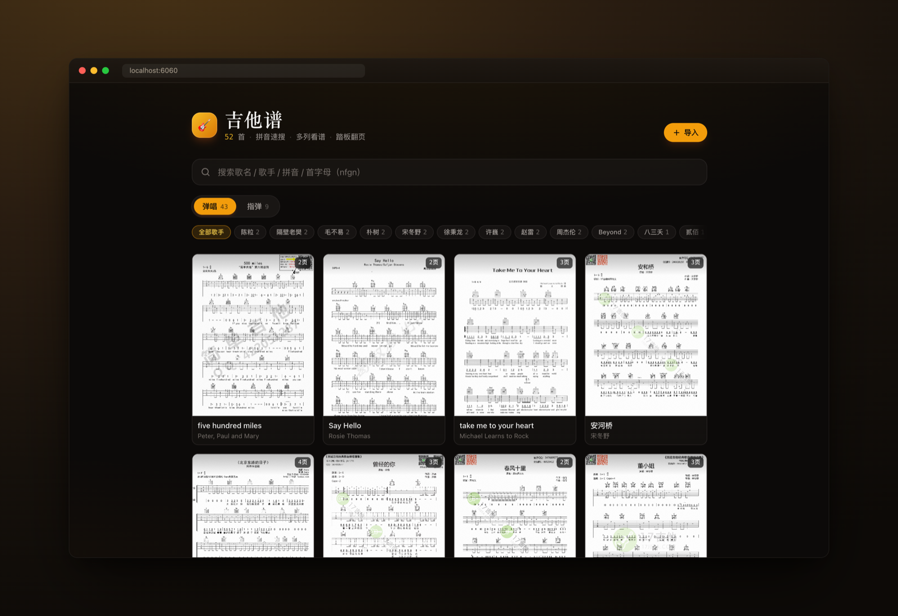
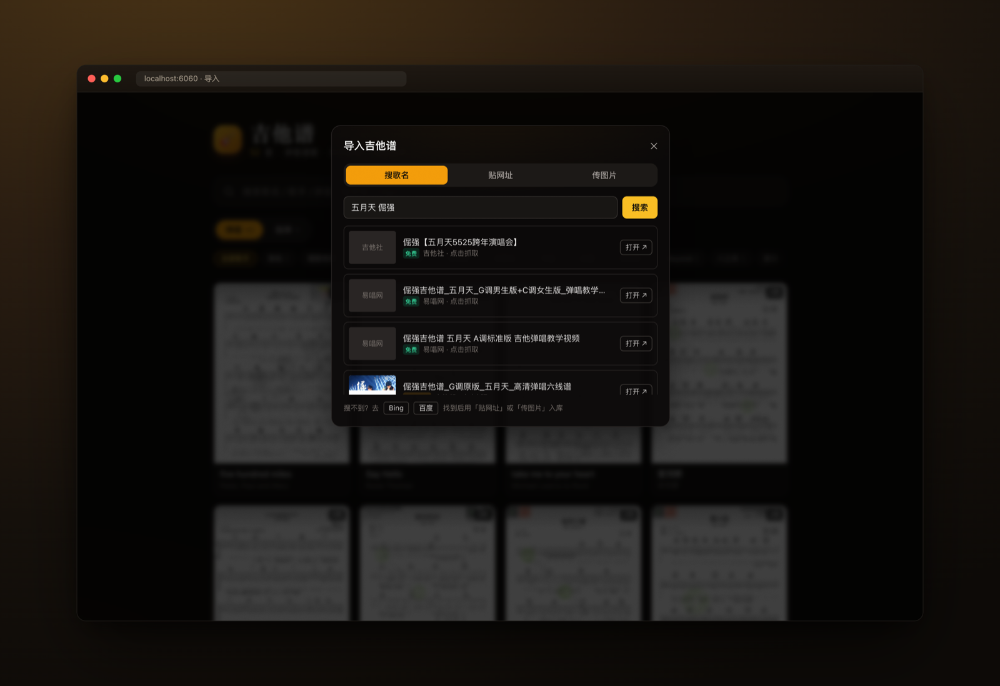
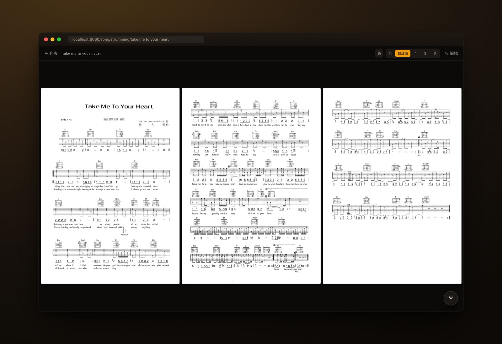
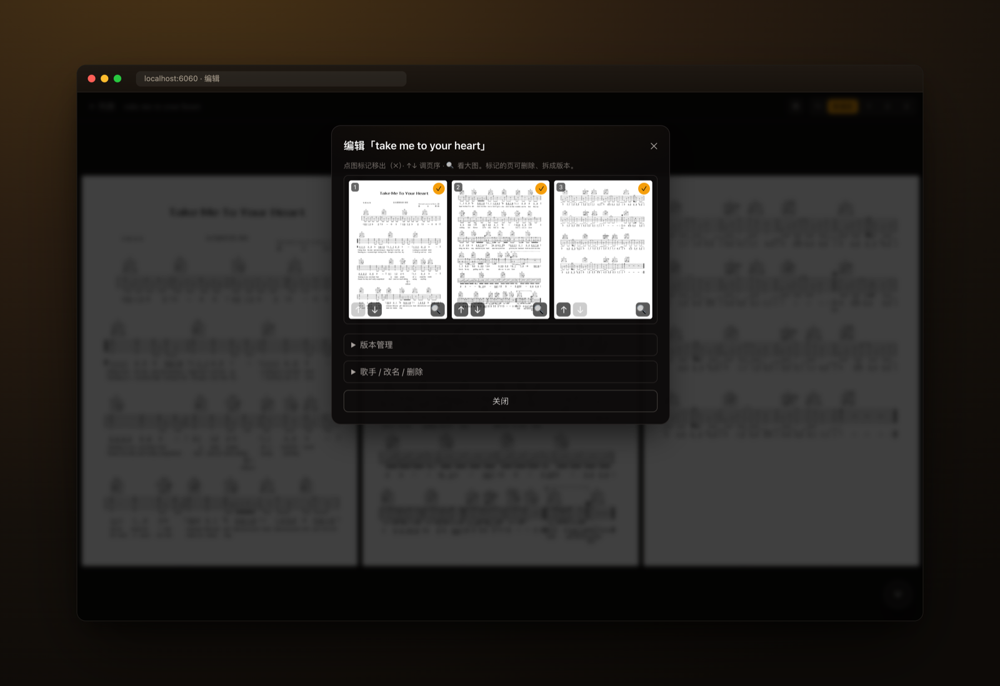

<div align="center">


# tabstand

**一个自托管的开源电子谱架**

找谱 → 看谱 → 翻谱 → 管谱 → 随便弹,一条龙

**简体中文** · [English](README.en.md)


</div>

---

自己弹吉他时，找谱、看谱、翻谱、管谱样样别扭：谱站搜得心烦、纸谱翻得腾手、手机谱挤成一团、攒下来的谱子散得到处都是。**tabstand** 把这一整条流程做顺——一个自托管的开源电子谱架，覆盖「找谱 → 看谱 → 翻谱 → 管谱 → 随便弹」全流程，弹奏时手一直留在琴弦上。

乐器中立的设计，目前实现吉他（弹唱 / 指弹）。**工具开源可分发，谱库私有**：谱子是受版权保护的扫描件，不进 git（`library/` 已 gitignore）。clone 下来后用网页的「导入」功能攒自己的谱库。

<div align="center">
  
</div>

## ✨ 一条龙：找谱 → 看谱 → 翻谱 → 管谱 → 随便弹

### 🔍 找谱
接入吉他社 / 易唱网 / 吉他帮 / 打谱网 / 绵羊乐谱 / 吉他园地等常用谱站搜索：**免费谱直接下载入库，付费谱买好后传图片导入**。三入口（搜歌名 / 贴 URL / 传图片）+ 人工兜底（打开原页 → 拖拽 / Ctrl+V 粘贴 → 预览排序）。歌名拼音 / 首字母模糊匹配，也能按歌手搜。缩略图缓存代理：搜索结果带预览，慢源 5 秒超时不拖全局。

### 👀 看谱
自适应多列布局（自适应 / 1 / 2 / 3 列，按歌记忆）——**电脑上三页以内整首一屏铺开，消灭翻页**。谱面亮度可切，护眼。

### 👇 翻谱
rAF 平滑**自动滚动** + 调速记忆；`keydown` 翻页兼容把自己当蓝牙键盘的**翻页踏板**（`↑↓←→` / `PageUp/Down` / 空格），弹奏时丝滑翻页、手不离弦。Wake Lock 防熄屏，PWA 可装到桌面当独立 App。

### 🎲 随便弹
想弹琴但选择困难？**心情抽歌**——按弹唱 / 指弹 / 所有筛选，「随机来一首」自动翻开一首谱，防连续重复。

### 🗂 管谱
**all-in-one 谱库管理**：调页序、删页、拆版本、移回主谱、改歌手 / 歌名 / 版本名（行内编辑），软删除进回收站防误删。同名不同歌手可作为两首歌区分，导入同名歌时三岔选择（新歌 / 同歌新版本 / 覆盖）。零数据库——`library/` 扫描成索引，改库刷新即生效。

> 📄 **附带**：Python 脚本可离线生成带书签 PDF（按拼音 / 字母排序 + 双页对齐补白），打印 / 离线练习兜底。

## 📸 截图

<table>
  <tr>
    <td width="50%">
      <br/>
      <sub><b>🔍 找谱</b> — 搜歌名聚合多个谱站，免费谱直接下载，抓不到的还能贴 URL / 传图片兜底</sub>
    </td>
    <td width="50%">
      <br/>
      <sub><b>👀 看谱</b> — 自适应多列，电脑上整首谱一屏铺开，亮度可切</sub>
    </td>
  </tr>
  <tr>
    <td width="50%">
      <br/>
      <sub><b>👇 翻谱</b> — 手机 / 平板竖屏，自动滚动 + 蓝牙踏板，弹奏时手不离弦</sub>
    </td>
    <td width="50%">
      <br/>
      <sub><b>🗂 管谱</b> — 调序 / 删页 / 拆版本 / 改歌手，删除走回收站</sub>
    </td>
  </tr>
</table>

## 🚀 快速开始

```bash
npm ci
npm run dev          # 本地开发，端口 6060（PORT env 可覆盖）
# 浏览器打开 http://localhost:6060
```

生产模式：

```bash
npm run build && npm start
```

> 局域网 / Tailscale 内的手机、平板访问 `http://<本机 IP>:6060` 即可当谱架用。

谱库为空时，用网页右上角的「＋ 导入」面板攒谱。也可命令行抓谱：

```bash
npm run grab -- <url> --name <歌名> --category strumming|fingerstyle [--version <版本名>]
```

国内谱站 CDN 默认直连；需代理时设 `GRAB_PROXY=http://127.0.0.1:7890`（Node fetch 经 undici ProxyAgent）。

## 📁 目录结构

```
library/strumming/<歌名>/                    弹唱谱，图片按 1.png 2.png… 编号（gitignore）
library/fingerstyle/<歌名>/                  指弹谱，结构同上
library/<分类>/<歌名>/versions/<版本名>/      同曲多版本
library/<分类>/<歌名>/meta.json              歌曲级元数据（歌手名，可选）
data/manifest.json                          scan 生成的索引（gitignore）
output/                                      生成的 PDF（gitignore）
```

`library/` 整体 gitignore：工具公开、谱库私有。

## 🛠 技术栈

Next.js 14 (App Router) + Tailwind CSS + React 18，零数据库。`scripts/scan.mjs` 扫 `library/` 生成索引，页面请求时读盘（`force-dynamic`），改库刷新即生效。抓取核心 `scripts/lib/grab-core.mjs` 被 CLI 与 Web 导入 API 共用。

## 📄 离线 PDF

```bash
uv run --with PyPDF2,reportlab,tqdm,pypinyin,Pillow scripts/get_pdf.py strumming
uv run --with PyPDF2,reportlab,tqdm,pypinyin,Pillow scripts/get_pdf.py fingerstyle
```

英文歌名按字母、中文歌名按拼音排序，每图等比缩放居中绘到 letter 页，奇数页歌曲补空白页（双页摊开左右对齐），按歌名加书签。`versions/` 子目录不参与 PDF。

## 🔒 安全边界 ⚠️

本服务**无登录认证**，信任边界是网络本身：**只在局域网 / Tailscale 内访问，不要 port-forward 或反代到公网**。任何能访问到端口的人都能查谱、导入、写库。

- 所有写操作 API（`/api/library`、`/api/import/*`）过同源守卫（跨站请求 403）
- 导入接口加 SSRF 防护：`/api/import/url` 拒绝抓取内网 / 环回 / 链路本地 / 云元数据地址，只允许公网 http(s)
- 上传走 magic-byte 校验 + 限额，staging 有 TTL 清理

若将来要暴露公网，必须先在前面加一层认证。

## 🚢 部署

macOS 可用 launchd 跑开机自启的本机后台服务，物料见 [`deploy/`](deploy/)。其他平台直接 `npm run build && npm start`。

## 📄 License

[MIT](LICENSE)。仅工具代码开源；谱库内容自带，版权归各自权利人所有，**请勿分发受版权保护的谱子**。
